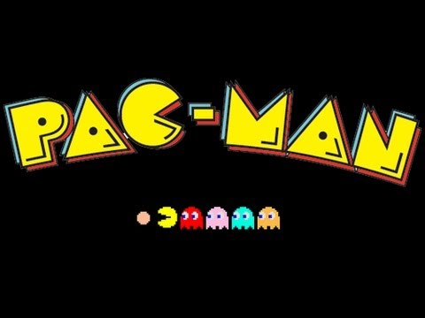
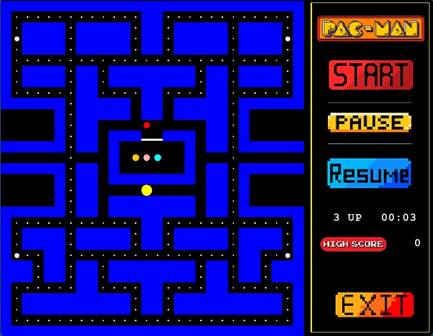

# PacMan Game
Simulation of the PacMan Game made for a university project 

<br />
Authors: * [Raquel Romero](https://github.com/Raquel-RP)
         * [Raquel Pulido](https://github.com/RaquelPP)
<br />

<!-- PROJECT LOGO -->
<br />
<div align="center">
  <a href="https://github.com/Raquel-RP/ComeCocos">
    
  </a>

  <h3 align="center">Pac-Man</h3>

  <p align="center">
    A simulation of a simple version of the Pac-Man game for a college project.
    <br />
    <a href="https://github.com/Raquel-RP/ComeCocos](https://github.com/Raquel-RP/ComeCocos/tree/main/Comecocos"><strong>Explore the project »</strong></a>
    <br />
    <br />
    <a href="https://github.com/Raquel-RP/ComeCocos/issues">Report Bug</a>
    ·
    <a href="https://github.com/Raquel-RP/ComeCocos/issues">Request Feature</a>
  </p>
</div>


<!-- TABLE OF CONTENTS -->
<details>
  <summary>Table of Contents</summary>
  <ol>
    <li>
      <a href="#about-the-project">About The Project</a>
      <ul>
        <li><a href="#built-with">Built With</a></li>
      </ul>
    </li>
    <li>
      <a href="#getting-started">Getting Started</a>
      <ul>
        <li><a href="#prerequisites">Prerequisites</a></li>
        <li><a href="#installation">Installation</a></li>
      </ul>
    </li>
    <li><a href="#usage">Usage</a></li>
    <li><a href="#roadmap">Roadmap</a></li>
    <li><a href="#contributing">Contributing</a></li>
    <li><a href="#contact">Contact</a></li>
    <li><a href="#acknowledgments">Acknowledgments</a></li>
  </ol>
</details>


<!-- ABOUT THE PROJECT -->
## About The Project
<div align="center">
  
  <h4>Game Interface</h4>
</div>

<br />

The project is the first to get me in touch with Java interfaces and the use of JPanel forms.
The main goal was making a functional and playable PacMan game. It is also my first time
using Threads in programming. 

The main functions the game has are:
* Being able to play a game with the main options: start, pause, resume and exit
* Gaining different points depending on the dot it eats
* Saving each game the highest score
* PacMan has 3 lives
* Functional chrono for each game


<p align="right">(<a href="#top">back to top</a>)</p>


### Built With

The resources used:

* [Apache NetBeans IDE 12.6](https://netbeans.apache.org/download/nb126/nb126.html)
* [Graphics](https://docs.oracle.com/javase/7/docs/api/java/awt/Graphics.html)
* [JFrame](https://docs.oracle.com/javase/7/docs/api/javax/swing/JFrame.html)

<p align="right">(<a href="#top">back to top</a>)</p>


<!-- GETTING STARTED -->
## Getting Started

Before running the project you need to follow some steps.

### Prerequisites

This is an example of how to list things you need to use the software and how to install them.
* npm
  ```sh
  npm install npm@latest -g
  ```

### Installation

_Below is an example of how you can instruct your audience on installing and setting up your app. This template doesn't rely on any external dependencies or services._

1. Get a free API Key at [https://example.com](https://example.com)
2. Clone the repo
   ```sh
   git clone git@github.com:Raquel-RP/ComeCocos.git
   ```
3. Install NPM packages
   ```sh
   npm install
   ```
4. Enter your API in `config.js`
   ```js
   const API_KEY = 'ENTER YOUR API';
   ```

<p align="right">(<a href="#top">back to top</a>)</p>


<!-- USAGE EXAMPLES -->
## Usage

To play the game is just as simple as the PacMan game. Press the button *Start* to start playing, move your keyboard arrows to move the PacMan.
It's important to keep the mouse pointer inside the game intermface for the controls to work. 
Use the *Pause* and *Resume* button to pause and restart the game (the chrono will stop too).

Press the *Exit* button to close the program.
<p align="right">(<a href="#top">back to top</a>)</p>


<!-- CONTRIBUTING -->
## Contributing

Any contributions you make are **greatly appreciated**.

If you have a suggestion that would make this better, please fork the repo and create a pull request. You can also simply open an issue with the tag "enhancement".
Don't forget to give the project a star! Thanks again!

1. Fork the Project
2. Create your Feature Branch (`git checkout -b feature/AmazingFeature`)
3. Commit your Changes (`git commit -m 'Add some AmazingFeature'`)
4. Push to the Branch (`git push origin feature/AmazingFeature`)
5. Open a Pull Request

<p align="right">(<a href="#top">back to top</a>)</p>


<!-- CONTACT -->
## Contact

Raquel Romero - raquelrp1426@hotmail.com

Project Link: [https://github.com/Raquel-RP/ComeCocos](https://github.com/Raquel-RP/ComeCocos)

<p align="right">(<a href="#top">back to top</a>)</p>
